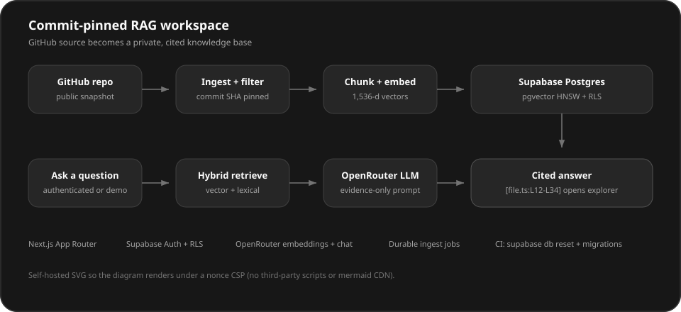
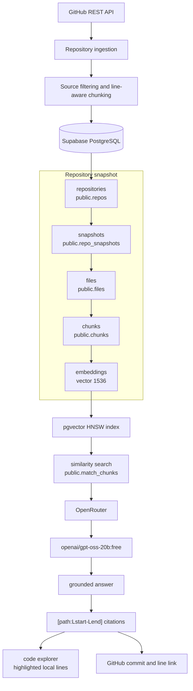
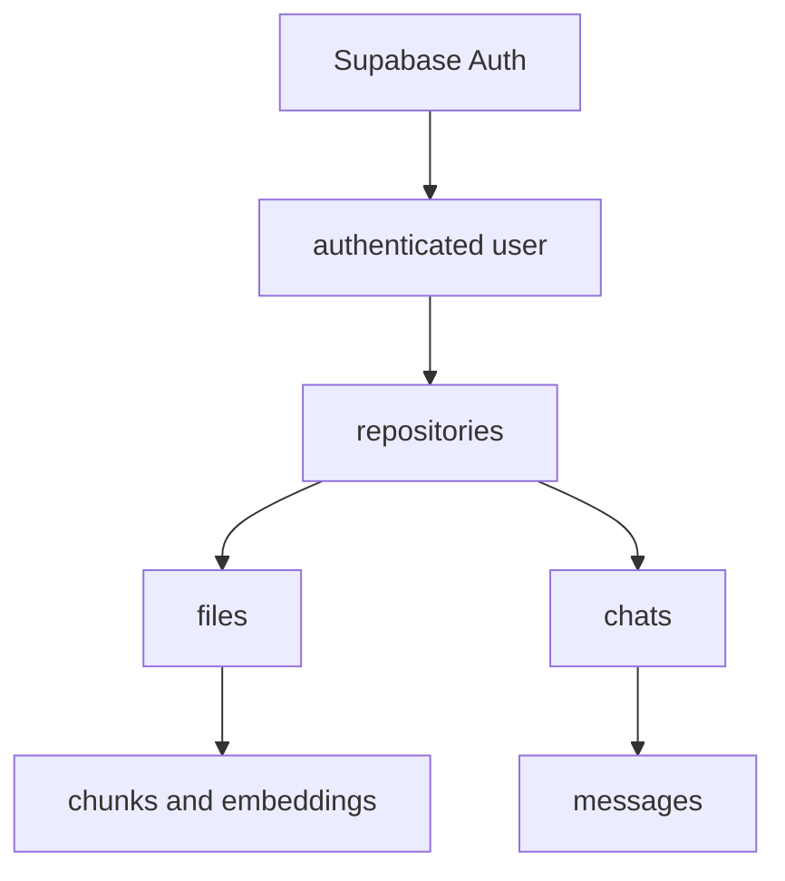
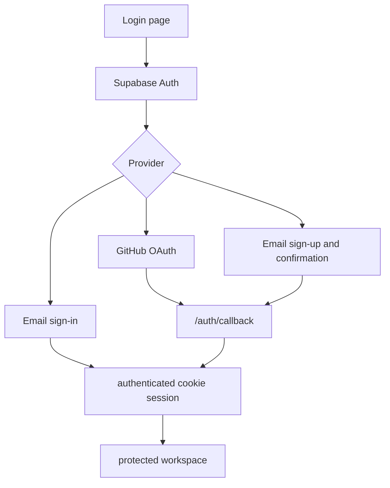
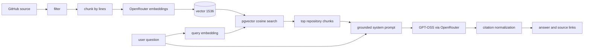

# DevDocs Copilot

Ask questions about any GitHub repository and get grounded answers with exact file + line citations.

## Live demo

**URL:** [https://devdocs-copilot.vercel.app/demo](https://devdocs-copilot.vercel.app/demo)

No account. No API keys. This repository is already indexed — ask a question and click a citation.

Locally, the same path is [http://localhost:3000/demo](http://localhost:3000/demo) after the app has Supabase + OpenRouter configured. The first visit enqueues the sample snapshot; indexing finishes through `/api/index` (no Vercel Cron).

## What this project does

Turns a public GitHub repository into a private, searchable snapshot. You ask questions; the model answers only from retrieved source and cites `[path:Lstart-Lend]`. Citations open the exact lines in the in-app explorer or on GitHub at the indexed commit.

## Why it matters

Turns any GitHub repo into a searchable, AI-powered knowledge base — commit-pinned, multi-tenant, and evidence-only instead of a generic chatbot.

## Architecture at a glance



Self-hosted SVG (no Mermaid CDN / `unsafe-inline` scripts), so the same diagram renders in GitHub and in the app under the nonce CSP.

## Tech highlights

- Next.js 16 App Router
- Supabase (Postgres + pgvector)
- OpenRouter LLM + embeddings
- Commit-pinned RAG system
- Multi-tenant auth with RLS
- CI with Supabase reset + migrations

---

**Portfolio summary:** a full-stack, multi-user RAG application that combines
GitHub ingestion, 1,536-dimensional semantic retrieval, grounded LLM answers,
actionable source citations, persistent conversations, and database-enforced
tenant isolation in a Next.js application.

## The problem

Understanding an unfamiliar repository usually means jumping between GitHub
search, local clones, documentation, and an AI assistant that may not know the
exact revision being inspected. DevDocs Copilot creates a searchable snapshot
of one repository commit and keeps every answer connected to the source lines
that support it.

The result is a workflow where an authenticated user can:

1. ingest a public GitHub repository;
2. browse the stored source snapshot;
3. search code by meaning rather than exact keywords;
4. ask repository-specific questions;
5. open citations directly in the local code explorer or on GitHub at the
   indexed commit; and
6. return later to the same repository and chat history.

## Key features

- **Public GitHub ingestion** from either
  `https://github.com/owner/repo` or `owner/repo`
- **Commit-pinned snapshots** of the repository's default branch
- **Source filtering** for generated/vendor directories, lockfiles, binary
  formats, empty files, and files larger than 200 KiB
- **Line-aware chunking** with up to 80 lines or 6,000 characters per chunk and
  a 10-line overlap
- **1,536-dimensional embeddings** generated with
  `openai/text-embedding-3-small` through OpenRouter
- **Supabase PostgreSQL + pgvector** storage and cosine-similarity search using
  an HNSW index
- **Versioned source snapshots** that stay searchable while a replacement is indexed
- **Hybrid retrieval** combining pgvector similarity and Postgres full-text search
- **Token streaming chat** with cancellation, request idempotency, and durable message status
- **Snapshot-pinned citations** that do not silently retarget after re-indexing
- **Owner rate limits** and privacy-safe chat/retrieval diagnostics
- **Public `/demo` workspace** that auto-loads an indexed snapshot of this repository
- **Grounded repository chat** using `openai/gpt-oss-20b:free`
- **Evidence-only prompting** that treats repository contents as untrusted data
  and refuses unsupported answers
- **Normalized citations** in `[path:Lstart-Lend]` format
- **Clickable citations and search results** that preserve the active chat and
  highlight the cited lines in the code explorer
- **Exact GitHub links** using the stored commit SHA and line range
- **Supabase Auth** with GitHub OAuth and email/password sign-in
- **User-owned repositories** with SHA-aware re-indexing and cascading deletion
- **Persistent chat threads and messages** scoped to a repository
- **RLS-based isolation** across repositories, files, chunks, chats, messages,
  and vector search

The diagram at the top of this README is the CSP-safe SVG used in the product.
The mermaid charts below add implementation detail for reviewers.

### Ingestion and retrieval



At the database level, embeddings are stored on `public.chunks` rather than in
a separate table; the diagram separates them to make the vector pipeline clear.

### Authentication and ownership



Every repository has a required `user_id`. Related files and chunks inherit
ownership through `repo_id`; chats carry both `user_id` and `repo_id`; messages
carry `user_id` and `chat_id`.

## How it works

### Authentication flow



- The browser starts GitHub OAuth with `signInWithOAuth`.
- GitHub returns to Supabase Auth at
  `https://<project-ref>.supabase.co/auth/v1/callback`.
- Supabase redirects to the application's `/auth/callback` route.
- The callback exchanges the PKCE code for a session and redirects to a
  sanitized in-app `next` path.
- Email sign-in uses `signInWithPassword` and then navigates in the browser.
  Sign-up uses `signUp` and can require email confirmation depending on the
  Supabase project setting.
- `src/proxy.ts` refreshes the Supabase session, attaches a nonce-based Content
  Security Policy, and redirects unauthenticated page requests to `/login`. It
  does not redirect `/api/*`; those routes must authenticate themselves.
- The chat API performs its own authentication and ownership checks before
  retrieval or generation.

### Repository ingestion and SHA-aware re-indexing

1. The server action validates the repository input and requires an
   authenticated user.
2. The GitHub REST API returns canonical metadata, the default branch, and its
   current commit SHA.
3. The **Re-index** action stops early only when the existing snapshot is
   `ready` and its stored `commit_sha` matches GitHub. Failed or incomplete
   snapshots are rebuilt even if the SHA matches. Adding the same repository
   again from the home form always rebuilds the snapshot.
4. The recursive Git tree is filtered (skip directories, lockfiles, binary
   extensions, empty files, and files over 200 KiB), then sorted alphabetically
   by path. The first 250 remaining files are fetched with a concurrency of
   eight. If GitHub reports a truncated tree, ingestion currently continues
   without treating that as an error.
5. Missing blobs and likely binary content are dropped after fetch.
6. Existing files for that owned repository are deleted. Foreign-key cascades
   remove their old chunks.
7. Source files are inserted in batches of 40.
8. The repository moves from `ingesting` to `indexing`; chunks and embeddings
   are generated and inserted. Indexing is started on demand from **Index
   repository** / **Re-index**, or by a signed-in `GET`/`POST` to `/api/index`.
   There is no Vercel Cron schedule (Hobby plans cannot run production crons).
   Repeated worker ticks are safe: jobs are claimed with a lease, unchanged
   SHA re-index is skipped, and an empty queue returns `{ status: "idle" }`.
9. A successful run records `file_count`, `chunk_count`, `commit_sha`,
   `last_indexed_at`, and status `ready`. Failures record status `failed` and an
   error message.

Repository deletion cascades through files, chunks, chats, and messages.

### RAG pipeline



Implementation details:

- File paths are prepended to chunk text before embedding.
- Embeddings are requested in batches of 32 with at most two parallel provider
  calls.
- Semantic search accepts at most 500 characters, uses a cosine similarity
  threshold of `0.2`, and returns eight results by default.
- The SQL function caps any requested result count to 20 and filters by both
  repository ID and `auth.uid()`.
- Chat questions are limited to 2,000 characters. A request may contain at most
  20 UI messages; generation uses the latest 12 persisted messages and retrieves
  eight chunks.
- Answers are produced with `generateText` and then written to the UI as a
  single completed response rather than token-by-token model streaming.
- The model receives source tokens such as `[S1]`. The server replaces them with
  exact stored paths and line ranges before persisting and returning the answer.
- If the retrieved context is insufficient, the prompt requires an explicit
  insufficient-evidence response.

### Citation system

Assistant answers use:

```text
[src/path/to/file.ts:L12-L34]
```

The server does not trust model-authored line numbers. Retrieved chunks receive
temporary source tokens, and `normalizeAnswerCitations` resolves those tokens
to the chunk's stored `path`, `start_line`, and `end_line`. Invented paths and
out-of-range citations are stripped. Answers with no remaining valid citations
are replaced with the insufficient-evidence message. When retrieval returns no
chunks, the chat API skips the model call entirely.

Clicking a citation builds a workspace URL containing:

```text
/repos/<owner>/<name>?path=<path>&lines=<start>-<end>&chat=<chat-id>#L<start>
```

The repository page loads the owned file, validates the requested range, keeps
the active chat selected, and highlights the cited lines. The file viewer's
external-link action uses the stored commit SHA:

```text
https://github.com/<owner>/<repo>/blob/<commit-sha>/<path>#L<start>-L<end>
```

This ties the citation to the exact indexed revision rather than a moving branch
head. The workspace header's "View on GitHub" link still opens the repository
root (`html_url`), not the commit-specific blob.

### Persistent chats

The persistence hierarchy is:

```text
repository
└── chat thread
    ├── user message
    ├── assistant message
    └── ...
```

Users create and delete threads from the repository workspace. A thread must
exist before a question can be asked. The first question replaces the default
`New chat` title with a deterministic title derived from that question.
Messages are stored in chronological order and restored when the page or
thread is reopened. Chat deletion cascades to its messages; repository
deletion cascades to all of its chats and messages.

Re-index and delete actions live on the home repository list (`/`). The
`/dashboard` route redirects there.

## Database schema and migrations

Apply every checked-in migration in order before running the app, tests, or
deployment smoke checks:

1. [`001_repos_and_files.sql`](supabase/migrations/001_repos_and_files.sql)
   creates repositories, files, indexes, the `set_updated_at` trigger, and the
   initial Phase 1 policies.
2. [`002_chunks_and_vector_search.sql`](supabase/migrations/002_chunks_and_vector_search.sql)
   enables `vector`, adds chunks and 1,536-dimensional embeddings, creates the
   HNSW cosine index, and defines `match_chunks`.
3. [`003_auth_workspace.sql`](supabase/migrations/003_auth_workspace.sql)
   adds repository ownership and indexing timestamps, creates chats and
   messages, replaces public-read policies with owner-only RLS, and makes
   `match_chunks` owner-aware.
4. [`004_production_chat.sql`](supabase/migrations/004_production_chat.sql)
   adds durable chat lifecycle columns, chat/idempotency constraints, and the
   initial ingest worker tables.
5. [`005_hybrid_retrieval_active_snapshot.sql`](supabase/migrations/005_hybrid_retrieval_active_snapshot.sql)
   adds snapshot-aware retrieval, lexical search, and active-snapshot helpers.
6. [`20260817145236_durable_ingest_jobs.sql`](supabase/migrations/20260817145236_durable_ingest_jobs.sql)
   replaces best-effort indexing with leased, retryable durable ingest jobs.
7. [`20260817151537_atomic_chat_rate_limit.sql`](supabase/migrations/20260817151537_atomic_chat_rate_limit.sql)
   moves owner chat rate limiting into PostgreSQL.
8. [`20260817151717_fix_atomic_chat_rate_limit.sql`](supabase/migrations/20260817151717_fix_atomic_chat_rate_limit.sql)
   corrects the initial Phase 7 rate-limit function definition.

Core relationships:

| Table | Purpose | Important ownership/relationship fields |
| --- | --- | --- |
| `public.repos` | Repository metadata and ingestion state | `user_id → auth.users.id`; unique `(user_id, owner, name)` |
| `public.files` | Full ingested source files | `repo_id → repos.id` with cascade delete |
| `public.chunks` | Line ranges, source text, and `vector(1536)` embeddings | `repo_id → repos.id`, `file_id → files.id`, both cascading |
| `public.chats` | Persistent repository threads | `user_id → auth.users.id`, `repo_id → repos.id` |
| `public.messages` | User and assistant text | `user_id → auth.users.id`, `chat_id → chats.id` |

Migration 003 creates a dedicated synthetic demo owner
(`demo@devdocs-copilot.local`) and assigns any pre-existing unowned
repositories to it before making `repos.user_id` non-null. It does not assign
those repositories to a real user's account.

For local validation, prefer the Supabase CLI so the schema is recreated from
the checked-in SQL exactly:

```bash
supabase start
supabase db reset --local --no-seed
```

## Security model

DevDocs Copilot applies access control in both application code and PostgreSQL:

- **Authentication:** protected pages call `requireUser`; `/api/chat` returns
  `401` without a valid Supabase user.
- **Repository ownership:** all repository lookups are made with an
  authenticated Supabase client, so RLS removes rows owned by other users.
  Server actions also compare returned `user_id` values before lifecycle
  operations.
- **Related data:** file and chunk SELECT policies require an owned parent
  repository. Chat SELECT/INSERT policies require both the chat user and parent
  repository to match `auth.uid()`; updates and deletes require the chat's
  `user_id` to match. Message policies require an owned parent chat, and inserts
  also require `messages.user_id = auth.uid()`.
- **Vector search:** `match_chunks` is a fixed-search-path
  `SECURITY DEFINER` function, but its query joins `repos` and requires
  `repos.user_id = auth.uid()`. Execute access is revoked from `PUBLIC` and
  `anon`. Authenticated owners can also `SELECT` their own `chunks` rows,
  including embedding vectors; other users cannot.
- **API authorization:** chat validates the authenticated user, owned
  repository, ready index, owned chat, and repository/chat relationship before
  reading history or invoking the model. `/api/*` is not redirected by
  `src/proxy.ts`, so each API route must enforce authentication itself.
- **Privileged writes:** `SUPABASE_SERVICE_ROLE_KEY` is imported only by
  server-only ingestion/indexing code. It must never be exposed to browser code
  or committed. Authenticated users have no INSERT/UPDATE/DELETE grants on
  `files` or `chunks`; those writes go through the service role during ingest.
- **Open-redirect protection:** the OAuth callback sanitizes `next` with
  `safeNextPath`, which allows only in-app absolute paths and rejects
  protocol-relative URLs. Email/password sign-in currently only checks that
  `next` starts with `/`.
- **Prompt-injection boundary:** repository source is labeled as untrusted data,
  and the model is told not to follow instructions contained in source files.
- **Browser security headers:** `src/proxy.ts` emits a per-request nonce CSP so
  Next.js framework scripts can run while inline and third-party scripts cannot.
  `next.config.ts` also sets clickjacking, MIME-sniffing, referrer, and
  Permissions-Policy headers on every route, including static assets that skip
  the proxy.

These layers prevent one authenticated user from listing, opening, searching,
chatting with, or deleting another user's repositories and derived data.

## Tech stack

Version strings below come directly from `package.json`.

### Runtime

| Technology | Version | Role |
| --- | --- | --- |
| Next.js | `16.3.1` | App Router, Server Components, Server Actions, route handlers, proxy |
| React / React DOM | `19.2.8` | UI |
| AI SDK | `^7.0.66` | Embeddings, model messages, and chat response transport |
| AI SDK React | `^4.0.69` | `useChat` client integration |
| OpenRouter provider | `^3.0.0` | Embedding and chat model access |
| Supabase JavaScript | `^2.112.3` | Auth, PostgREST, RPC, and admin operations |
| Supabase SSR | `^0.12.4` | Browser/server clients and cookie sessions |
| Tailwind CSS | `^4` | Styling |
| Radix UI | `^1.6.7` | Accessible UI primitives |
| shadcn | `^4.18.0` | Component tooling |
| Lucide React | `^1.31.0` | Icons |
| next-themes | `^0.4.6` | Theme management |
| Sonner | `^2.0.8` | Toast notifications |

Additional runtime utilities are `class-variance-authority@^0.7.1`,
`clsx@^2.1.1`, `tailwind-merge@^3.6.0`, `tw-animate-css@^1.4.0`, and
`server-only@^0.0.1`.

### Development tooling

| Tool | Version |
| --- | --- |
| TypeScript | `^5` |
| Vitest | `^4.1.10` |
| ESLint | `^9` |
| eslint-config-next | `16.3.1` |
| Tailwind PostCSS plugin | `^4` |
| Babel React Compiler plugin | `1.0.0` |
| Node type definitions | `^20` |
| React / React DOM type definitions | `^19` |

## Project structure

```text
devdocs-copilot/
├── src/
│   ├── app/
│   │   ├── actions/                 # Auth, repository, and chat Server Actions
│   │   ├── api/chat/route.ts        # Authenticated grounded-chat endpoint
│   │   ├── auth/callback/route.ts   # Supabase PKCE code exchange
│   │   ├── login/                   # GitHub and email/password UI
│   │   ├── demo/page.tsx            # Public sample workspace (this repo)
│   │   ├── repos/[owner]/[name]/    # Repository workspace and code explorer
│   │   └── page.tsx                 # Owned-repository dashboard
│   ├── components/                  # Chat, search, file tree/viewer, lifecycle UI
│   ├── lib/
│   │   ├── ai/                      # Chunking, embeddings, indexing, search, prompts
│   │   ├── chat/                    # Message conversion and thread titles
│   │   ├── github/                  # API client, parsing, filtering, ingestion
│   │   ├── repo/                    # Workspace links and line-range validation
│   │   ├── security/                # CSP and browser security header builders
│   │   └── supabase/                # SSR/browser/admin clients, queries, auth, types
│   └── proxy.ts                     # Session refresh, CSP nonce, page-route protection
├── supabase/
│   └── migrations/                  # Ordered Phase 1, 2, and 5 SQL migrations
├── .env.example                     # Environment variable template
├── vitest.config.ts                 # Node-based test configuration
├── next.config.ts                   # React Compiler, Turbopack, and static security headers
└── package.json                     # Scripts and pinned dependency declarations
```

## Getting started

Open [the live demo](https://devdocs-copilot.vercel.app/demo) if you only want to try chat. The steps below are for running the full app yourself.


### Prerequisites

- Node.js and npm
- A Supabase project
- An OpenRouter API key
- A GitHub OAuth App for GitHub sign-in
- Optional: a GitHub personal access token to raise GitHub REST API rate limits

This repository does not include `supabase/config.toml`; the documented default
is to run the Next.js app locally against a Supabase project. If you already use
the Supabase CLI and have initialized/linked this repository, the migration
files are compatible with that workflow.

### 1. Clone and install

```bash
git clone <your-fork-or-repository-url>
cd devdocs-copilot
npm install
```

### 2. Configure environment variables

```bash
cp .env.example .env.local
```

Replace every placeholder required for your setup. Never commit `.env.local`.

### 3. Create the database

Create a Supabase project, open **SQL Editor**, and run every checked-in
migration in order:

```text
supabase/migrations/001_repos_and_files.sql
supabase/migrations/002_chunks_and_vector_search.sql
supabase/migrations/003_auth_workspace.sql
supabase/migrations/004_production_chat.sql
supabase/migrations/005_hybrid_retrieval_active_snapshot.sql
supabase/migrations/20260817145236_durable_ingest_jobs.sql
supabase/migrations/20260817151537_atomic_chat_rate_limit.sql
supabase/migrations/20260817151717_fix_atomic_chat_rate_limit.sql
```

Migration 002 enables the `vector` extension automatically and creates the
`extensions.vector(1536)` column plus its HNSW cosine index. If you use an
initialized and linked Supabase CLI project, prefer `supabase db reset --local`
for repeatable local validation and `supabase db push` for linked remote
environments.

### 4. Configure authentication

Complete the [Supabase Auth and GitHub OAuth setup](#supabase-auth-and-github-oauth-setup)
below before signing in.

### 5. Start development

```bash
npm run dev
```

Open [http://localhost:3000](http://localhost:3000). Unauthenticated page
requests redirect to `/login`.

### 6. Verify the project

```bash
npm run verify:migrations
npm run check-env
npm test
npm run lint
npm run typecheck
npm run build
```

## Environment variables

### Public/browser variables

Anything prefixed with `NEXT_PUBLIC_` is included in the browser bundle.

| Variable | Required | Used for |
| --- | --- | --- |
| `NEXT_PUBLIC_SUPABASE_URL` | Yes | Supabase project URL used by browser, server, proxy, and tests |
| `NEXT_PUBLIC_SUPABASE_ANON_KEY` | Yes | Public Supabase key used with RLS-protected browser/server sessions |

### Server-only secrets

| Variable | Required | Used for |
| --- | --- | --- |
| `SUPABASE_SERVICE_ROLE_KEY` | Yes | Privileged ingestion/indexing writes and RLS integration-test setup |
| `OPENROUTER_API_KEY` | Yes for ingestion, search, and chat | `openai/text-embedding-3-small` and `openai/gpt-oss-20b:free` through OpenRouter |
| `GITHUB_TOKEN` | No, recommended | Raises GitHub REST API limits; sent only by the server-side GitHub client |

`SUPABASE_SERVICE_ROLE_KEY`, `OPENROUTER_API_KEY`, and `GITHUB_TOKEN` must not use
the `NEXT_PUBLIC_` prefix.

### Template variable currently not consumed

`.env.example` also contains:

| Variable | Current behavior |
| --- | --- |
| `NEXT_PUBLIC_SITE_URL` | `getSiteUrl()` defines a localhost fallback, but the current auth UI and callback derive origins from the browser/request; no active application path currently reads this helper |

It is safe to set `NEXT_PUBLIC_SITE_URL=http://localhost:3000` locally and to
your public origin in production, but current redirect behavior still depends
on the Supabase URL configuration described below.

## Supabase Auth and GitHub OAuth setup

### Supabase project

1. Create a project and copy its project URL and public anon key into
   `.env.local`.
2. Copy the service-role key into `SUPABASE_SERVICE_ROLE_KEY`. Keep it
   server-only.
3. Apply all three migrations in order.
4. Confirm that `public.repos`, `public.files`, `public.chunks`,
   `public.chats`, and `public.messages` have RLS enabled.
5. Confirm that the `vector` extension and `public.match_chunks` function exist.

### GitHub OAuth provider

1. Create a GitHub OAuth App.
2. Set the OAuth App callback URL to:

   ```text
   https://<project-ref>.supabase.co/auth/v1/callback
   ```

3. In Supabase, open **Authentication → Providers → GitHub**, enable the
   provider, and enter the GitHub OAuth App client ID and client secret.
4. In **Authentication → URL Configuration**, set:

   ```text
   Site URL: http://localhost:3000
   ```

5. Add redirect URLs for every environment:

   ```text
   http://localhost:3000/auth/callback
   https://<your-production-domain>/auth/callback
   ```

The GitHub OAuth callback and the application callback are different: GitHub
calls Supabase's `/auth/v1/callback`; Supabase then redirects to the
application's `/auth/callback`.

### Email/password

Email/password authentication is enabled through Supabase's email provider.
For local testing, either disable **Confirm email** in the Supabase project or
complete the email confirmation link before attempting to sign in. Confirmation
redirects must also allow `/auth/callback`.

## Testing

The Vitest configuration runs `src/**/*.test.ts` in a Node environment.

### Unit coverage

The 12 unit tests cover:

- GitHub repository input parsing;
- unchanged-SHA re-index decisions;
- line-range validation for citation navigation;
- safe post-auth redirects and open-redirect rejection; and
- deterministic chat-thread titles.

### RLS integration coverage

`src/lib/supabase/ownership.integration.test.ts` runs when these values are
available in `.env.local`:

```text
NEXT_PUBLIC_SUPABASE_URL
NEXT_PUBLIC_SUPABASE_ANON_KEY
SUPABASE_SERVICE_ROLE_KEY
```

It creates two confirmed temporary users and an owned repository fixture,
proves that the second user cannot read the repository/files/chats, cannot
retrieve its chunks through `match_chunks`, cannot attach a chat to it, and
cannot delete it. It then verifies that the owner can delete it and cleans up
the temporary users.

Be aware that this test uses the configured Supabase project, not an embedded
database. Use a development project.

### Current verified results

Verified against the current working tree:

```text
Vitest:     6 files passed, 13 tests passed (12 unit + 1 RLS integration)
ESLint:     passed
TypeScript: passed with npx tsc --noEmit
Next.js:    production build passed
```

The production build includes `/`, `/login`, `/dashboard`, `/demo`,
`/auth/callback`, `/api/chat`, and `/repos/[owner]/[name]`.

## Development commands

| Command | Purpose |
| --- | --- |
| `npm run dev` | Start the Next.js development server |
| `npm run check-env` | Fail fast when required runtime variables are missing |
| `npm run verify:migrations` | Verify the checked-in Phase 7 migration set is present |
| `npm test` | Run all Vitest tests once |
| `npm run lint` | Run ESLint |
| `npm run typecheck` | Run strict TypeScript checking |
| `npm run ci` | Run migration verification, env validation, lint, typecheck, tests, and production build |
| `npm run build` | Create and validate the production build |
| `npm start` | Serve a previously created production build |

## Current limitations

- **Public repositories only.** Supabase GitHub login authenticates the app
  user; it is not used to obtain repository-scoped GitHub credentials. The
  server rejects repositories reported as private.
- **Repository size limits.** After filtering, ingestion keeps the first 250
  remaining files in alphabetical path order and skips files over 200 KiB.
  GitHub's recursive-tree `truncated` flag is currently ignored, so very large
  repositories can produce incomplete snapshots without a dedicated error.
- **On-demand ingestion.** Fetching, embedding, and database writes run in a
  leased ingest job started from the UI or `/api/index`, not a Vercel Cron.
  The index route allows up to 300 seconds. Large repositories can still hit
  platform execution limits or provider quotas. Repeating `/api/index` is
  idempotent: a second concurrent claim returns `idle`, and Re-index skips an
  unchanged ready SHA.
- **SHA skip is Re-index only.** The dashboard Re-index button skips work when
  the ready snapshot already matches the current default-branch commit. Adding
  the same repository from the ingest form rebuilds it.
- **App-wide GitHub token.** `GITHUB_TOKEN` is a single optional server
  credential, not a per-user installation or OAuth token.
- **Provider dependency.** Indexing, search, and chat require OpenRouter and the
  configured model identifiers to remain available. The selected chat model is
  a free model and may be rate-limited.
- **Public demo is a shared snapshot.** `/demo` loads `DiwanMalla/devdocs-copilot`
  for the synthetic demo owner. `vercel/next.js` and `facebook/react` exceed the
  250-file ingest cap, so they are not used as the public sample. The demo is
  read-only aside from ephemeral chat.
- **Chat is not token-streamed.** The model generates the full answer, then the
  API returns it as one completed UI message.
- **Workspace query state is partial.** Switching chats, searching, or opening
  a file can drop other query parameters such as `path`, `lines`, or `q`.
- **Plain source viewer.** The code explorer provides line numbers, navigation,
  and highlighting but not syntax highlighting, collapsible folders, or a full
  editor.
- **No deployment configuration.** The repository has a production build
  command but no checked-in deployment pipeline or production infrastructure
  configuration.
- **Database hardening remains.** The Phase 1 `public.set_updated_at` trigger
  function does not pin its PostgreSQL `search_path`, so Supabase's database
  advisor reports a mutable-search-path warning. The owner-aware
  `match_chunks` function does pin an empty search path.

## Roadmap

- ✅ **Phase 1 — GitHub ingestion**
- ✅ **Phase 2 — Semantic search**
- ✅ **Phase 3 — Grounded repository chat**
- ✅ **Phase 4 — Actionable citations**
- ✅ **Phase 5 — Authenticated workspace**
- ⬜ **Phase 6 — Private repository support**
- ⬜ **Phase 7 — Production polish and deployment**

## Troubleshooting

### Missing Supabase environment variables

If the dashboard reports that Supabase is not configured, confirm all three
values are present and restart the dev server:

```text
NEXT_PUBLIC_SUPABASE_URL
NEXT_PUBLIC_SUPABASE_ANON_KEY
SUPABASE_SERVICE_ROLE_KEY
```

Do not substitute the service-role key for the browser anon key.

### Missing tables, columns, policies, or `match_chunks`

Apply every checked-in migration in `supabase/migrations/` before starting the
app. For local development, `supabase db reset --local --no-seed` is the
safest way to guarantee the schema matches the repository. A missing `chunks`
table, `chunk_count` column, `vector` type, durable ingest RPC, or
`match_chunks` function usually means the local or remote database is behind the
checked-in Phase 7 migration set.

### pgvector or embedding errors

- Confirm migration 002 completed and the `vector` extension exists in the
  `extensions` schema.
- Confirm `OPENROUTER_API_KEY` is present and restart Next.js after changing it.
- The application requires exactly 1,536 values from
  `openai/text-embedding-3-small`; it rejects embeddings with any other
  dimension.

### GitHub OAuth redirects to the login page with an error

Check both callback layers:

1. GitHub OAuth App callback:
   `https://<project-ref>.supabase.co/auth/v1/callback`
2. Supabase allowed redirect:
   `http://localhost:3000/auth/callback` or the production equivalent

Also confirm that the GitHub provider is enabled in Supabase and its client
credentials are correct.

### Email sign-up succeeds but sign-in fails

If email confirmation is enabled, complete the confirmation email first. For
local-only testing, you can disable confirmation in the Supabase project's
email-provider settings.

### GitHub ingestion returns 403 or rate-limit errors

Add a server-only `GITHUB_TOKEN` and restart the app. Without a token, GitHub's
unauthenticated REST limit is much lower. A 403 can also mean that the requested
repository is private, which is not supported yet.

### Search or chat returns no evidence

Confirm the repository status is `ready`, `chunk_count` is greater than zero,
and `OPENROUTER_API_KEY` is valid. Semantic search intentionally omits chunks
below the `0.2` similarity threshold, and chat refuses to invent an answer when
the retrieved context is insufficient.

### The RLS integration test is skipped

The integration suite skips itself if any required Supabase variable is absent.
Populate `.env.local` and run `npm test` against a development Supabase project.

### CI or startup fails fast on configuration

Run `npm run check-env` to verify the required runtime variables, and
`npm run verify:migrations` to confirm the repository still contains the full
Phase 7 migration set expected by CI and deployment docs.
